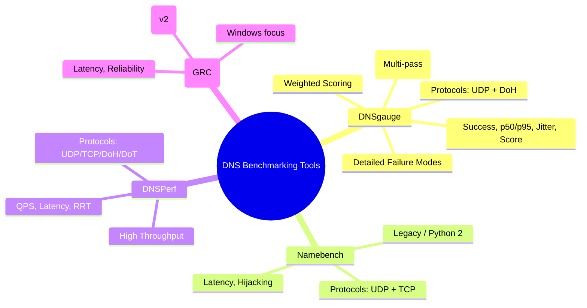

# DNSgauge

A command-line tool to benchmark DNS servers and DNS-over-HTTPS (DoH) endpoints. Tests default providers (Cloudflare, NextDNS, Quad9, Mullvad) or custom servers, measuring latency, stability, and success rates across multiple domains.

Results are displayed in a weighted performance table, helping you find the absolute best resolver for your network.

## Installation

### Homebrew (Recommended)
```bash
brew tap themorgantown/dnsgauge
brew install dnsgauge
```

### Linux (pipx, Recommended)
```bash
# 1. Install pipx (one-time)
python3 -m pip install --user pipx
python3 -m pipx ensurepath

# 2. Install from source
git clone https://github.com/themorgantown/homebrew-dnsgauge.git
cd homebrew-dnsgauge
pipx install .
```

### Linux (venv)
```bash
# 1. Create a virtual environment
python3 -m venv .venv
source .venv/bin/activate

# 2. Install from source
pip install .
```

### pip (Manual)
```bash
pip install .
```

## Features

- **Dual protocol support**: UDP (port 53) and DNS-over-HTTPS (DoH).
- **Modern Defaults**: Includes Cloudflare, Google, NextDNS, Quad9, Mullvad, AdGuard, OpenDNS, and LibreDNS.
- **Smart Metrics**: Calculates weighted scores based on success, tail latency (p95), and stability (jitter).
- **Pro Features**:
  - **HTTP/2 & Keep-Alive**: Reuses connections for DoH to simulate real browser behavior.
  - **UDP Truncation**: Correctly handles and measures TCP fallback for large responses.
  - **Warm Mode**: Run multiple passes and ignore the first one to test cached performance.
  - **Comprehensive Mode**: Drill down into NXDOMAIN, SERVFAIL, and transport-layer details.

## Why DNSgauge

Many DNS benchmark tools focus on a single protocol, rely on basic averages, or provide limited visibility into failure modes. DNSgauge is built to give a more realistic, decision-ready view of resolver performance:

- **UDP + DoH, side by side**: Compare classic DNS with modern DoH under the same workload.
- **Tail-aware scoring**: We weight success rate, p95 latency, and jitter so “fast but flaky” resolvers don’t look good.
- **Warm mode**: Optional multi-pass runs to observe cached vs. cold behavior.
- **Comprehensive diagnostics**: Breakdowns for NXDOMAIN, SERVFAIL, HTTP errors, parsing errors, truncation, and TCP fallback.
- **Practical defaults**: Curated providers and sensible query types so you can run it immediately.

## Comparison to Other Tools
| Feature       |                           DNSgauge                            |      Namebench      |      DNSPerf      | DNS Benchmark (GRC) |
| :------------ | :-----------------------------------------------------------: | :----------------: | :---------------: | :-----------------: |
| Protocols     |                           UDP + DoH                           |     UDP + TCP      |  UDP/TCP/DoH/DoT  | UDP + DoH/DoT (v2)  |
| Metrics       |                Success, p50/p95, Jitter, Score                | Latency, Hijacking | QPS, Latency, RRT | Latency, Reliability |
| Scoring       |                    Weighted score (0-100)                     |        None        |       None        |        None         |
| Multi-pass    |                        Yes (Warm Mode)                        |         No         |        No         |         No          |
| Failure modes | NXDOMAIN, SERVFAIL, HTTP errors, parsing errors, truncation, | NXDOMAIN Hijacking | Timeouts, RCODEs  | Reliability, DNSSEC |

### Feature Comparison Map



## Usage

```bash
# Basic run (10 domains, default providers)
dnsgauge

# Use Warm Mode (3 passes, ignore pass 1)
dnsgauge --passes 3 --mode warm

# Comprehensive Drilldown
dnsgauge --comprehensive

# Specific Query Types
dnsgauge --qtypes A,AAAA,HTTPS

# Custom Servers
dnsgauge --udp 8.8.8.8 --doh https://dns.nextdns.io
```

### CLI Arguments

| Argument | Description |
| :--- | :--- |
| `-h, --help` | Show help message and exit |
| `--version` | Show program's version number and exit |
| `-dohnly` | Run only DNS-over-HTTPS (DoH) tests |
| `--no-keepalive` | Disable HTTP Keep-Alive (use new connection per query) |
| `--comprehensive` | Print comprehensive drilldown table instead of summary table |
| `--mode {mixed,warm}` | Aggregation mode (default: `mixed`) |
| `--passes N` | Number of passes over the same queries (default: 1) |
| `--qtypes CSV` | Comma-separated QTYPEs to test (default: `A,AAAA,HTTPS`) |
| `--edns-payload N` | EDNS0 UDP payload size (default: 1232) |
| `--udp IP` | Add a custom UDP DNS server IP (repeatable) |
| `--doh URL` | Add a custom DoH server URL (repeatable) |
| `--domains N` | Number of random domains to test (default: 10) |
| `--timeout S` | Timeout per query in seconds (default: 2.5) |
| `--seed N` | Random seed for domain selection |

## Metrics Reference

### Summary Table
- **Score**: Weighted quality metric (0-100). Higher is better.
- **Success**: % of queries with a valid DNS response.
- **p50 / p95**: Median and 95th percentile latency (ms).
- **Jitter**: Latency standard deviation (consistency).
- **Notes**: Extra info like HTTP version or connection reuse %.

### Comprehensive Table (`--comprehensive`)
- **N**: Total queries sent per server.
- **Avg**: Average latency (ms).
- **NX / SF**: % of NXDOMAIN and SERVFAIL responses.
- **HTTPerr**: % HTTP protocol errors (DoH).
- **ParseErr**: % DNS wire-format parsing errors.
- **Trunc / TCPfb**: % UDP truncation and subsequent TCP fallback.
- **RespKB_p95**: 95th percentile response size in Kilobytes.
- **Reuse~**: Estimated percentage of TCP/H2 connection reuse.

## Development

### Core Structure
- **src/dnsgauge.py**: Main engine containing CLI parsing, metrics math, and query logic.
- **Formula/dnsgauge.rb**: The Homebrew formula definition.
- **scripts/test_homebrew.sh**: Automated local testing script for formula changes.

### Adding Providers
Edit `src/dnsgauge.py` and modify `DEFAULT_SERVERS`:
```python
DEFAULT_SERVERS: List[ServerTarget] = [
    ServerTarget("MyProvider", "UDP", "192.0.2.1"),
]
```

## License
MIT License. See `pyproject.toml` for details.
